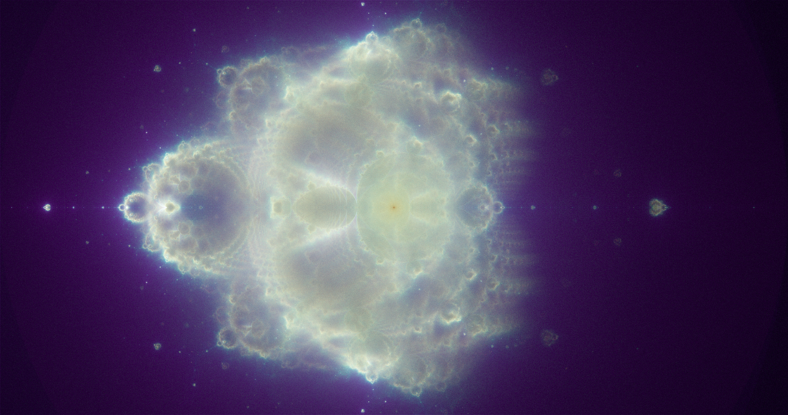

# Buddhabrot Renderer

This project renders the [Buddhabrot](https://en.wikipedia.org/wiki/Buddhabrot) using C++.

## Performance

Rendered on an Intel Core i7-1065G7 using all 8 threads (CPU has 4 cores) in just 16.690 Seconds!

Resolution: 2048x1080

Max Orbits: 100,000,000

## Features

- Multithreading (using std::thread)
- Spectral Color Palette
- [Triple32 Hash](https://nullprogram.com/blog/2018/07/31/)

## Building

This repository requires the [OpenGL Mathematics (GLM)](https://github.com/g-truc/glm) library.

> TODO: Update this section with platform-specific build directions
